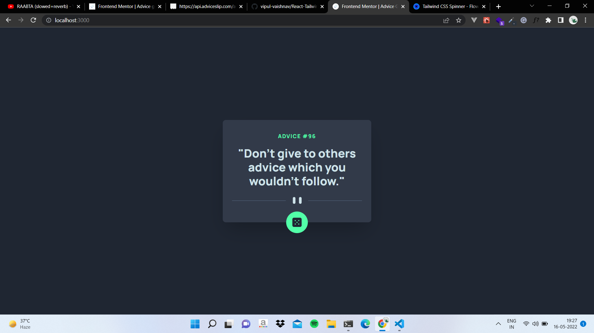

# Frontend Mentor - Advice generator app solution

This is a solution to the [Advice generator app challenge on Frontend Mentor](https://www.frontendmentor.io/challenges/advice-generator-app-QdUG-13db). Frontend Mentor challenges help you improve your coding skills by building realistic projects.

## Table of contents

- [Overview](#overview)
  - [Screenshot](#screenshot)
  - [Links](#links)
- [My process](#my-process)
  - [Built with](#built-with)
- [Author](#author)

### Screenshot

### Links

- Solution URL: [Code](https://github.com/vipul-vaishnav/React-Tailwind-advicegen)
- Live Site URL: [Website](https://react-advice-gen-2.netlify.app/)

## My process

### Built with

- Semantic HTML5 markup
- CSS custom properties
- Flexbox
- CSS Grid
- Mobile-first workflow
- [Tailwind CSS](https://tailwindcss.com/) - Utility First CSS framework
- [React](https://reactjs.org/) - JS library

## Author

- Github - [@vipul-vaishnav](https://github.com/vipul-vaishnav)
- Frontend Mentor - [@vipul-vaishnav](https://www.frontendmentor.io/profile/vipul-vaishnav)
- Twitter - [@\_\_stfuvipul](https://www.twitter.com/__stfuvipul)
